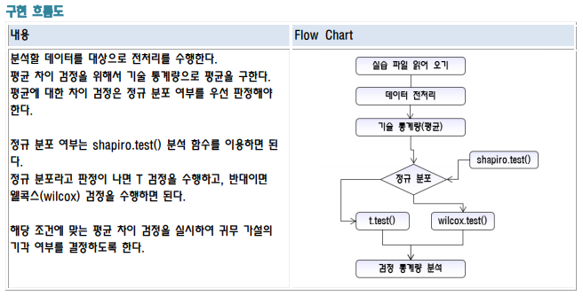

<!-- 
# R-Studio 도 함수를 만들 수 있다.
> plyr 를 이용하여 merge와 join을 사용하자!<br>
> 파이프라인 함수 를 사용하기 위해 dplyr 로 필요합니다.<br>
> 패키지 로드순서는 plyr -> dplyr 순서로 로드 해주시기 바랍니다. -->

## 파일 소스
우클릭 -> 다른이름으로 링크저장 이용해 주세요<br>
<a href="../assets/sources/S20191031.zip" class="btn btn-lg btn-outline">
S20191031.zip
</a><br>
<br>

## 사용 함수
> shapiro.test() 정규 분포 검증함수(hist)<br>
> t.test() 정규 분포 일때<br>
> wilcox.test() 비정규 분포 일때<br>

## 로직


## 사용 예시 소스코드 1
```r
# 우리 나라 전체 중학교 2학년 여학생 평균 키가 148.5cm로 알려져 있는 상태에서 
# A 중학교 2학년 전체 500명을 대상으로 10%인 50명을 표본으로 선정하여 표본 평균 신장을
# 계산하고 모집단의 평균과 차이가 있는지를 각 단계별로 분석을 수행하여 검정하시오.
# 
# 파일 이름 : student_height.csv
# 
# 단계1: 데이터셋 가져오기
df <- read.csv("student_height.csv")
df

range(df$height)
hei <- df$height
hei

# 단계2: 기술 통계량/결측치 확인
table(is.na(hei)) # 결측치 없음.
# 기술 통계량
describe(hei)

# 요구 사항 : height에서 결측치는 제거하고 실습하도록 하세요.
# 원래 없는디..?

install.packages("wilkox")
library(wilkox)
# 단계3: 정규성 검정
table(is.na(hei)) # 결측치 없음.
shapiro.test(hei) # p의 값이 작으므로 정규성이 없다.
hist(hei)
# 비정규 분포 데이터를 정규 분포 데이터로 변환(제곱)
# left X^3 hist차트의 분포 형태가 왼쪽 일때.
# mild left X^2 
# mild right sqrt(X) 
# right ln(X) 
# severe right 1/X 

# 정규 분포가 아니면 wilcox.test() 검정을 수행해야 한다.
# 정규 분포(모수검정) - t.test()
# 비정규 분포(비모수검정) - wilcox.test()
# 
# 단계4: 가설 검정 - 양측 검정
# 연구가설 : 알려져 있는 우리나라 여학생 평균 신장 정보는 차이가 있다.
# 귀무가설 : 알려져 있는 우리나라 여학생 평균 신장 정보는 차이가 없다.
w <- wilcox.test(hei, mu = 148.5, alternative = "two.sided")
w$p.value > 0.05
```