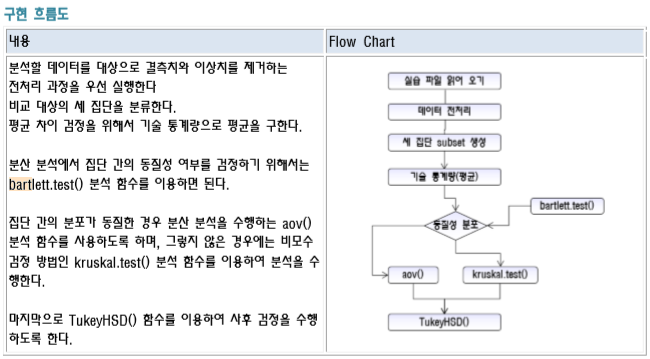

<!-- 
# R-Studio 도 함수를 만들 수 있다.
> plyr 를 이용하여 merge와 join을 사용하자!<br>
> 파이프라인 함수 를 사용하기 위해 dplyr 로 필요합니다.<br>
> 패키지 로드순서는 plyr -> dplyr 순서로 로드 해주시기 바랍니다. -->

## 파일 소스
우클릭 -> 다른이름으로 링크저장 이용해 주세요<br>
<a href="../assets/sources/S20191101.zip" class="btn btn-lg btn-outline">
S20191101.zip
</a><br>
<br>

## 사용 함수
> prop.test() 세집단 비율 검정<br>
> bartlett.test() 분산분석 전 선행 동질검사<br>
> aov() 동질한 경우<br>
> kruskal.test() 동질하지 않은경우<br>
> TukeyHSD() 마지막 사후 검정<br>

## 로직


## 사용 예시 소스코드 1
```r
# 세 집단 비율 검정(교육 만족도)
# 세 집단을 대상으로 비율의 차이 검정을 통해서 세 집단간의 비율이 동일한지 또는 아닌지를 검정하는 방법이다.
# 
# 파일 이름 : E01.세 집단 비율 검정(교육 만족도_정답).R
# 
# 연구 환경
# 한국 교육 센터에서는 3가지 교육 방법(집체 교육, 개별 교육, 혼합 교육)을 이용하여 교육을 실시하였다.
# 좀더 효과적인 교육 방법이 무엇인지를 조사해보니 다음과 같은 설문 조사 결과가 나왔다.
# 
# 교육 방법과 만족도 교차 분할표
# 교육 방법 	 만족 	 불만족 	 참가자 
# 집체 교육	34	16	50
# 개별 교육	37	13	50
# 혼합 교육	39	11	50
# 합계	110	40	150
# 
# 가설
# 귀무 가설
# 세 가지 교육 방법에 따라 집단 간의 만족율에 차이가 없다.
# 
# 연구 가설
# 세 가지 교육 방법에 따라 집단 간의 만족율에 차이가 있다.
df <- read.csv("three_sample.csv")
head(df)
method <- df$method
survey <- df$survey

unique(method)
unique(survey) # 0(불 만족)

addmargins(table(method, survey, useNA = "ifany"))

# 세 가지 교육 방법에 따라 집단 간의 만족율에 차이가 없다.
three <- prop.test(x=c(34, 37, 39), n=c(50, 50, 50))
three

three$p.value > 0.05 # 귀무가설 채택

# 분산 분석(교육 방법에 따른 실기 시험 평균)
# 분산 분석은 T 검정과 동일하게 평균에 의한 차이 검정 방법이다.
# 차이점은 분산 분석일 경우 세 집단 이상의 평균 차이를 검정하는 것이다.
# 
# 파일 이름 : F01.분산 분석(교육 방법에 따른 평균_정답).R
# 
# 연구 환경
# 한국 교육 센터에서는 3가지의 교육 방법(집체 교육, 개별 교육, 혼합 교육)을 
# 이용하여 각 50명씩 실기 시험을 실시하였다.
# 세 집단간 실기 시험의 평균에 차이가 있는 지 검사한다.
# 
# 가설
# 귀무 가설
# 세 가지 교육 방법에 따른 실기 시험의 평균에 차이가 없다.
# 
# 연구 가설
# 세 가지 교육 방법에 따른 실기 시험의 평균에 차이가 있다.
df01 <- read.csv("three_sample.csv", header = T)
df01

unique(df01$method)
summary(df01$score)
range(df01$score)

# missing value, oulier 제거
df01 <- subset(df01, !is.na(score), c(method, score))
head(df01)
str(df01)
range(df01$score) # 큰 데이터 478 ?

plot(df01$score)
myBox <- boxplot(df01$score)
names(myBox)
myBox 
# $stats
# [,1]
# [1,] 2.00
# [2,] 4.35
# [3,] 5.80
# [4,] 6.50
# [5,] 8.50
# 
# $n
# [1] 91
# 
# $conf
# [,1]
# [1,] 5.443898
# [2,] 6.156102
# 
# $out
# [1]  70 285 478 <-- 이상치
# 
# $group
# [1] 1 1 1
# 
# $names
# [1] "1"

barplot(df01$score, col = rainbow(length(df$score)), xlab = "점수", main = "점수 분포차트")

# 이상치 제거 하기.
length(df01$score)
df02 <- subset(df01, score < 70)
length(df02$score)
boxplot(df02$score) # 세 집단 subset 생성

# 가독성을 위해 코딩 변경
df02$method2[df02$method == 1] = "방법1"
df02$method2[df02$method == 2] = "방법2"
df02$method2[df02$method == 3] = "방법3"

# 빈도(frequency) 확인
table(df02$method2)
x <- table(df02$method2)
y <- tapply(df02$score, df02$method2, mean)

x
y

# 데이터 프레임 생성 기술 통계량 평균
df <- data.frame(교육방법=x, 성적=y)
df
str(df)

# 동질성 검사중...
# bartlett.test(종속변수 ~ 독립변수, data=dataSet) 
# bartlett.test(score ~ method2, data=mydata2) 
bartlett.test(score ~ method2, data=df02)
0.1905 > 0.05 # TRUE:귀무가설 채택 / 방법 1, 2, 3 은 동일한 교육 방식이다.

# 최종 검정.
result <- aov(score ~ method2, data = df02)
result
names(result)
summary(result)

9.39e-14 > 0.05 # 귀무가설 기각

# 사후 검정은 분산 분석의 결과에 대하여 구체적으로 어떻게 차이가 나는 지를 보여주는 부분이다.
thsd <- TukeyHSD(result)
thsd$method2
# diff        lwr   upr        p adj
# 방법2-방법1  2.612903  1.9424342  3.2833723 2.084165e-10
# 방법3-방법1  1.422903  0.7705979  2.0752085 3.976611e-06
# 방법3-방법2 -1.190000 -1.8656509 -0.5143491 1.910760e-04

# diff는 두 집단의 평균의 차이를 말한다. 
# 방법 2 와 방법1 의 평균 차이가 가장 큰 것으로 나타났다. 
# lwr 은 신뢰 구간의 하한 값, upr 은 신뢰 구간의 상한 값이다. 
# p adj 은 다중 비교를 위하여 조절된 p-value 값이다

plot(thsd)

# 피어슨 상관계수 확인해보기.
# x <- c(3, 5, 8, 11, 13)
# y <- c(6, 10, 16, 22, 26)

x <- c(3, 5, 8, 11, 13)
y <- c(1, 2, 3, 4, 5)

# 상관계수 확인해 보기. (오른쪽 상승 대각선 양의 상관계수) 
plot(x, y, type = "o", cex = 1.5)
mean_x <- mean(x)
mean_y <- mean(y)

# 분모 분자 구하기.
bunja <- sum((x-mean_x)*(y-mean_y))
bunmo <- sqrt(sum((x-mean_x)**2)*sum((y-mean_y)**2))

# 상관 계수 구하기.
corr <- bunja / bunmo
corr

# 상관계수 함수 표현
cor(x, y)

# 상관계수(x, y) = 공분산(x, y) / (표준편차(x) * 표준편차(y))
sd_X <- sd(x)
sd_y <- sd(y)

# 공분산(covariance) 구하기
corr * sd_X * sd_y

cor(x, y)
cov(x, y)
```