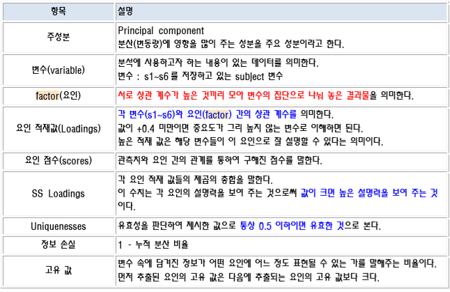
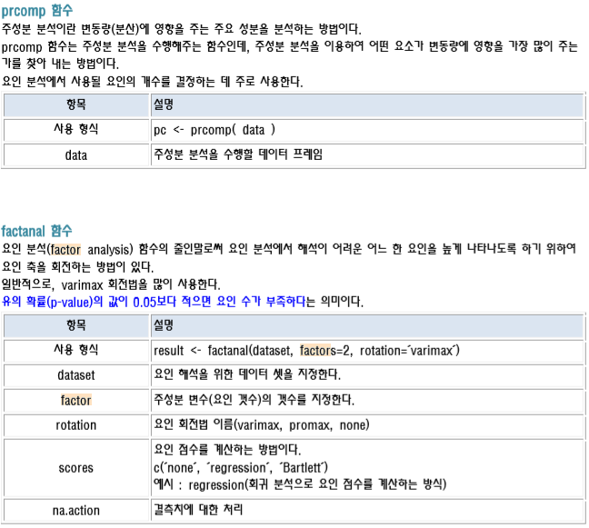
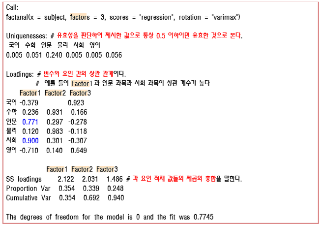

## 파일 소스
우클릭 -> 다른이름으로 링크저장 이용해 주세요<br>
<a href="../assets/sources/S20191104.zip" class="btn btn-lg btn-outline">
S20191104.zip
</a><br>
<br>

## 사용 함수
> prcomp 주성분 분석 수행 함수<br>
> cor 상관계수 계산 함수<br>
> corrgeam 상관계수 도표 차트<br>
> factanal 요인 분석 함수<br>
> scatterplot3d 3d스캐터 차트 함수<br>
<!-- > TukeyHSD() 마지막 사후 검정<br> -->

## 설명 PART 1

> 요인 수를 결정하는 방법  요인수를 결정하는 방법은 크게 주성분 분석 방법과 <br>
> 상관 계수 행렬을 이용한 초기 고유 값을 이용하는 방법이 있다. <br>

## 설명 PART 2

> factanal 출력 결과 예시 <br>
> result <- factanal(subject, factors=3, rotation='varimax', scores='regression') result <br>

## 설명 PART 3


## 사용 예시 소스코드 1
```r
# 파일 이름 : factor_analyze.csv
# 위의 파일을 이용하여 요인 분석을 수행하세요
# 
# 주성분 분석 수행 함수를 이용하여 주성분 갯수를 파악해 보세요.
# 상관 계수를 이용하여 개략적인 상관 관계를 예측해 보세요.
# 고유 값을 이용하여 주성분 요인수를 파악해보세요.
# 고유 값을 이용한 시각화를 수행해 보세요.
# 요인 분석을 수행하세요.
# 요인 점수를 이용하여 요인 적재량을 시각화해보세요.
# 3차원 산점도로 요인 적재량을 시각화해보세요.
# 요인별 산술 평균을 이용하여 변수의 갯수를 줄여 보세요.
# 추려진 요인들을 이용하여 상관 관계 분석을 수행해 보세요.

# prcomp 함수는 주성분 분석을 수행해주는 함수인데, 주성분 분석을 이용하여 어떤 요소가 변동량에 영향을 가장 많이 주는  가를 찾아 내는 방법이다.
df <- read.csv("factor_analyze.csv", header = T)
str(df)
# unique(df)

pc <- prcomp(df)
summary(pc)
str(pc) # PC <- 주성분 이란 뜻.
# Importance of components:구성 요소의 중요성
#                          PC1    PC2     PC3     PC4     PC5     PC6
# Standard deviation     2.389 1.5532 0.87727 0.56907 0.19315 0.12434 <-- 표준 편차
# Proportion of Variance 0.616 0.2603 0.08305 0.03495 0.00403 0.00167 <-- 분산의 비율
# Cumulative Proportion  0.616 0.8763 0.95936 0.99431 0.99833 1.00000 <-- 누적 비율 
# 누적 비율을 보아 하니 PC1 과 PC2 의 누적 비율의 합이 87%가 넘어가므로 두개의 카테고리로
# 정리해야할 확률이 높다. 아직은 결정이 나지 않은 상태이다.

# plot 그리기
myColor <- rainbow(ncol(df))
plot(pc, main = "prcomp result", col = myColor, ylim = c(0, 6))
abline(h=seq(0, 6, 1), lty = 2)
legend(x = "topright", legend = c("pc1", "pc2", "pc3", "pc4", "pc5", "pc6") , col = myColor, fill = myColor, bty = 'o')

# 상관계수 그래프 그리기
library(corrgram)
cor(df) # 상관계수 계산
corrgram(cor(df), upper.panel = panel.conf) # 상관계수 도표 그리기기
# 요인 분석은 기본적으로 상관 계수를 토대로 공통점을 인식한다.

# 요인수를 결정 하는 방법(values 이용)
en <- eigen(cor(df))
en$values # 고유치
# [1] 3.44393944 1.88761725 0.43123968 0.19932073 0.02624961 0.01163331
en$vectors
#            [,1]         [,2]        [,3]       [,4]        [,5]        [,6]
# [1,] -0.4062499 -0.351093036  0.63460534 -0.3149622  0.45699508  0.03041553
# [2,]  0.2542077 -0.628807884 -0.06984072 -0.3339036 -0.35389906 -0.54622817
# [3,]  0.4763815  0.008436692  0.58035475  0.6016209  0.05643527 -0.26654314
# [4,]  0.3017115 -0.566028650 -0.37734321  0.2468016  0.50326085  0.36333366
# [5,]  0.5155637  0.021286661  0.31595023 -0.4133867 -0.28995329  0.61559319
# [6,] -0.4319311 -0.400526644  0.11564711  0.4422216 -0.57042232  0.34452594
# 고유 값(eigen value)의 사용처 : 
# 선형 연립 방정식 
# 값 분해 
# 주성분 분석 

plot(en$values, type = 'o', pch = 19) # 엘보우 포인트 : 꺾은선이 완만하게 바뀌는 포인트
# 고유값을 보면 주성분을 3개로 간주 할 수 있다.

# p-value 구하기
# 어떤 데이터를 다른 데이터에 비해 부각 시키기 위해서 varimax 회전법을 많이쓴다 이는 디폴트 값이다.
result <- factanal(df, factors = 2, rotation = "varimax")
result
# Call:
#   factanal(x = df, factors = 2, rotation = "varimax")
# 
# Uniquenesses:
#   국어  수학  인문  물리  사회  영어 
# 0.250 0.005 0.407 0.136 0.107 0.015 
# 
# Loadings:
#   Factor1 Factor2
# 국어  0.862         
# 수학          0.997 
# 인문 -0.692   0.338 
# 물리 -0.115   0.923 
# 사회 -0.846   0.421 
# 영어  0.988         
# 
# Factor1 Factor2
# SS loadings      2.928   2.152
# Proportion Var   0.488   0.359
# Cumulative Var   0.488   0.847
# 
# Test of the hypothesis that 2 factors are sufficient.
# The chi square statistic is 11.32 on 4 degrees of freedom.
# The p-value is 0.0232 

# 유의 확률 값이 0.05보다 적으면 요인 수가 부족하다 는 것이다.
# 즉, 뭔가 잘못 된 자료란 것이다.
# factors = 2 말고 다른 매개 값을 넣어보는게 어때? 라는 조언이다.
0.0232 > 0.05 # FALSE

result <- factanal(df, factors = 3, rotation = "varimax")
result
# Loadings: 서로 연관성이 있는 컬럼의 원자값은 비율이 얼마 차이 나지 않는다.
#     Factor1 Factor2 Factor3
# 국어 -0.379           0.923 
# 수학  0.236   0.931   0.166 
# 인문  0.771   0.297  -0.278 
# 물리  0.120   0.983  -0.118 
# 사회  0.900   0.301  -0.307
# 영어 -0.710   0.140   0.649

#                Factor1 Factor2 Factor3
# SS loadings      2.122   2.031   1.486 <- 위 loadings 에서 관련 값들이 얼마나 설득력이 있는지.
# Proportion Var   0.354   0.339   0.248
# Cumulative Var   0.354   0.692   0.940

result <- factanal(df, factors = 3, rotation = "varimax", scores = "regression")
result

attributes(result)
result$loadings # 적재량
#     Factor1 Factor2 Factor3
# 국어 -0.379           0.923 
# 수학  0.236   0.931   0.166 
# 인문  0.771   0.297  -0.278 
# 물리  0.120   0.983  -0.118 
# 사회  0.900   0.301  -0.307 
# 영어 -0.710   0.140   0.649 

#                Factor1 Factor2 Factor3
# SS loadings      2.122   2.031   1.486
# Proportion Var   0.354   0.339   0.248
# Cumulative Var   0.354   0.692   0.940

result$scores # 요인 점수
#         Factor1     Factor2     Factor3
# [1,]  0.7357870 -0.98034177 -1.07981805
# [2,] -0.6640013  0.87937769 -0.83543481
# [3,]  0.7357870 -0.98034177 -1.07981805
# [4,]  0.6917075 -0.02812698 -0.27885523
# [5,] -0.7387206 -0.69135360 -0.07138837
# [6,] -1.7858690  0.33608991  0.30957945
# [7,]  1.0449596  1.66369477 -0.11745856
# [8,] -1.0999660  0.22263533 -0.17382007
# [9,]  0.9197524  0.96404108  1.40734566
# [10,]  0.1605633 -1.38567464  1.91966803

# 시각화 Factor1과 Factor2
mylwd <- 5
plot(result$scores[, c(1:2)], lwd=mylwd, col="red")

name <- paste("문제", c(1:10), sep="")
name
myCex <- 0.8
myPos <- 3
text(result$scores[, 1], result$scores[, 2], labels = name, cex = myCex, pos = myPos, col = "blue")

points(result$loadings[, c(1:2)], pch = 19, col = "green", lwd = mylwd)
text(result$loadings[, 1], result$loadings[, 2], labels = row.names(result$loadings), cex = myCex, pos = myPos, col = "blue")

abline(h = 1.0, lwy = 2)
abline(v = 1.0, lwy = 2)

# 3D scatter plot 그리기
# install.packages("scatterplot3d")
library(scatterplot3d)

# 변수 맵핑
Factor1 <- result$scores[, 1]
Factor2 <- result$scores[, 2]
Factor3 <- result$scores[, 3]
loading1 <- result$loadings[, 1]
loading2 <- result$loadings[, 2]
loading3 <- result$loadings[, 3]

d3 <- scatterplot3d(Factor1, Factor2, Factor3, type = 'p', color='blue', angle = 35)
d3$points3d(loading1, loading2, loading3, bg="red", pch=21, cex=2, type = 'h')


# 요인별 산술 평균
app_science <- (df$수학 + df$물리)/2
soc_science <- (df$인문 + df$사회)/2
net_science <- (df$국어 + df$영어)/2

app_science
soc_science
net_science

# 데이터 프레임 만들기
subject_factor_df <- data.frame(app_science, soc_science, net_science)
subject_factor_df
```