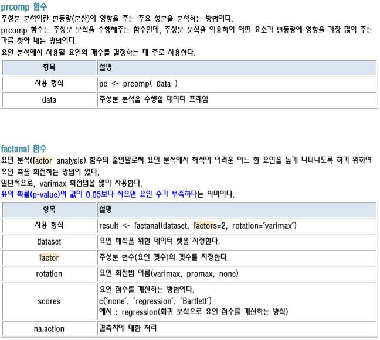
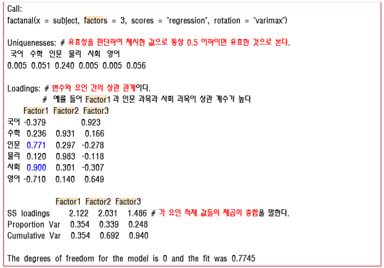

## 파일 소스
우클릭 -> 다른이름으로 링크저장 이용해 주세요<br>
<a href="../assets/sources/S20191104.zip" class="btn btn-lg btn-outline">
S20191104.zip
</a><br>
<br>

## 사용 함수
> prcomp 주성분 분석 수행 함수<br>
> cor 상관계수 계산 함수<br>
> corrgeam 상관계수 도표 차트<br>
> factanal 요인 분석 함수<br>
> scatterplot3d 3d스캐터 차트 함수<br>
<!-- > TukeyHSD() 마지막 사후 검정<br> -->

<!-- ## 설명 PART 1 -->
<!-- 
> 요인 수를 결정하는 방법  요인수를 결정하는 방법은 크게 주성분 분석 방법과 <br>
> 상관 계수 행렬을 이용한 초기 고유 값을 이용하는 방법이 있다. <br> -->

<!-- ## 설명 PART 2

> factanal 출력 결과 예시 <br>
> result <- factanal(subject, factors=3, rotation='varimax', scores='regression') result <br>

## 설명 PART 3
 -->

## 사용 예시 소스코드 1
```r
# 최소 제곱법(자승법)
test <- read.csv("linear_reg.csv", header = T)
head(test)

mean_x <- mean(test$x)
x <- test$x

mean_y <- mean(test$y)
y <- test$y

bunja <- sum((x-mean_x)*(y-mean_y))
bunja

bunmo <- sum((x-mean_x)**2)
a <- bunja/bunmo
b <- mean_y - a * mean_x

a
b

# 
plot(test, pch='*', lwd=2, cex=2.0, col='blue')
abline(a=b, b=a, col="red", lwd=2)

# 머신러닝 학습 을 포뮬러 형태로 인자를 제공하고 나오는 결과물을 model 이라고 함.
# 그래서 변수명은 model로 정의.
model <- lm(y ~ x, data=test)
model

# Call:
#   lm(formula = y ~ x, data = test) call 메소드
# 
# Coefficients: 회기계수
#   (Intercept)            x  기울기 = x, 절편 = intercept
#          7.70         5.45  

attributes(model) 
# $names model이 가지고 있는 변수
# [1] "coefficients"  "residuals"     "effects"       "rank"          "fitted.values" "assign"        "qr"           
# [8] "df.residual"   "xlevels"       "call"          "terms"         "model"        
# 
# $class
# [1] "lm"

model$fitted.values
# y예측치(적합값)
# 1     2     3     4 
# 149.4 160.3 171.2 182.1 

head(test)
#    x   y
# 1 26 148
# 2 28 164
# 3 30 168
# 4 32 183

# head(test) - fitted.values : 잔차 라고한다.
model$residuals # 잔차 매개변수

summary(model)
# Call:
#   lm(formula = y ~ x, data = test)
# 
# Residuals:
#   1    2    3    4 
# -1.4  3.7 -3.2  0.9 
# 
# Coefficients: 회기계수
#   Estimate Std. Error t value Pr(>|t|)  
# (Intercept)    7.700     23.764   0.324   0.7767  
# x              5.450      0.817   6.671   0.0217 *
#   ---
#   Signif. codes:  0 ‘***’ 0.001 ‘**’ 0.01 ‘*’ 0.05 ‘.’ 0.1 ‘ ’ 1
# 
# Residual standard error: 3.654 on 2 degrees of freedom
# Multiple R-squared:  0.957,	Adjusted R-squared:  0.9355 
# F-statistic:  44.5 on 1 and 2 DF,  p-value: 0.02174

# x = 117이면 y=?
x <- c(110, 120, 130, 140, 150)
y <- c(100, 105, 128, 115, 142)

# 잔차의 제곱의 가장 이상적인 값은 0으로 가면 갈수록 좋다.
iq <- lm(y ~ x)
iq
plot(iq, pch='*', lwd=2, cex=2.0, col='blue')
```

## 사용 예시 소스코드 2
```r
# df <- read.csv("test01.csv", header = T)
# df <- read.csv("test02.csv", header = T)
df <- read.csv("test03.csv", header = T)
df

x <- df$x
y <- df$y

model <- lm(y ~ x, data = df)
model

plot(df, pch='*', lwd=2, cex=2.0, col="blue", main="y=2*x+1 linear regression")
# coef : 회귀 직선 구하는 함수
abline(coef(model), col="red", lwd=2)

attributes(model)
model$coefficients # 회귀계수
model$fitted.values # 예측치
resi <- model$residuals # 잔차

resi_sqrt_total <- sum(resi**2) # 잔차 의 제곱의 총합
resi_sqrt_total

summary(model)
# Call: 포뮬러 정보.
#   lm(formula = y ~ x, data = df)
# 
# Residuals: 잔차
#   1     2     3     4 
# 0.04 -0.12  0.12 -0.04 
# 
# Coefficients: 
#              Estimate Std. Error t value Pr(>|t|) p - value 값.    
# (Intercept)  1.10000    0.15492    7.10 0.019263 *  
#   x            1.96000    0.05657   34.65 0.000832 ***
#   ---
#   # ***가 3개면 유의미하다.
#   Signif. codes:  0 ‘***’ 0.001 ‘**’ 0.01 ‘*’ 0.05 ‘.’ 0.1 ‘ ’ 1
# 
# Residual standard error: 0.1265 on 2 degrees of freedom
#          R-squared : 상관계수
# Multiple R-squared:  0.9983,	Adjusted R-squared:  0.9975 
# F-statistic:  1201 on 1 and 2 DF,  p-value: 0.0008319 # sqrt값이 이될수록 퍼펙트한 값이됨.
# 결정 계수가 1이면 일수록(상관계수) 유의미한 값이다. 반대로 가면 유의미 하지않은 값이다.(상관없는)
# p값이 0.05 보다 크면 부적합하다 라는 뜻이다. 

sc <- read.csv("시험 점수와 공부 시간1.csv")
# sc <- read.csv("시험 점수와 공부 시간2.csv")

x <- sc$공부시간
y <- sc$학교성적

model <- lm(y ~ x, data = sc)
model

plot(x, y, pch='*', lwd=2, cex=2.0, col="blue", main="y=2*x+1 linear regression", ylim= c(0, 130))
# coef : 회귀 직선 구하는 함수
abline(coef(model), col="red", lwd=2)

attributes(model)
model$coefficients # 회귀계수
model$fitted.values # 예측치
resi <- model$residuals # 잔차

resi_sqrt_total <- sum(resi**2) # 잔차 의 제곱의 총합
resi_sqrt_total

summary(model)

2.463e-05 > 0.05 # FALSE
# 유의확률이 TRUE 면 회귀선이 모델에 부적합하다는 의미이다.
# 예시는 FALSE 이므로 적합하다고 볼 수 있다.
```

## 사용 예시 소스코드 3
```r
# 파일 이름 : product.csv
# 제품의 적절성("appropriacy") 이 제품의 만족도("satisfaction") 에 얼마나 영향을 주는지
# 회귀 분석을 수행해보기
df01 <- read.csv("product.csv", header = T)
df01 <- df01[-1]
str(df01)

x <- df01$appropriacy # 독립 변수(종속 변수에 변화를 주는 변수)
y <- df01$satisfaction # 종속 변수(독립 변수에 의해 변화를 받는 변수)

model01 <- lm(y ~ x, data = df01)
model01

plot(df01, pch='*', lwd=2, cex=2.0, col="blue", main="y=2*x+1 linear regression")
# coef : 회귀 직선 구하는 함수
abline(coef(model01), col="red", lwd=2)

attributes(model01)
model01$coefficients # 회귀계수
model01$fitted.values # 예측치
resi <- model01$residuals # 잔차

resi_sqrt_total <- sum(resi**2) # 잔차 의 제곱의 총합
resi_sqrt_total
##########################################################################
# 파일 이름 : factor_analysis.csv
# 위의 파일을 이용하여 요인 분석을 수행하세요
fac_Analysis <- read.csv("factor_analysis.csv")
str(fac_Analysis)

# 상관 계수를 이용하여 개략적인 특징을 파악해 보세요.
pc <- prcomp(fac_Analysis)
summary(pc)
# Importance of components:
#                           PC1    PC2    PC3    PC4     PC5     PC6
# Standard deviation     2.9724 1.5844 1.4889 0.6763 0.44834 0.34049
# Proportion of Variance 0.6163 0.1751 0.1546 0.0319 0.01402 0.00809
# Cumulative Proportion  0.6163 0.7914 0.9460 0.9779 0.99191 1.00000
# 누적 비율을 보아 하니 PC3 까지의 누적 비율의 합이 94%가 넘어가므로 두개의 카테고리로
# 정리해야할 확률이 높다. 아직은 결정이 나지 않은 상태이다.

# 상관 계수를 그래프를 그려 보세요.
# plot 그리기
library(corrgram)
cor(fac_Analysis) # 상관계수 계산
corrgram(cor(fac_Analysis), upper.panel = panel.conf) # 상관계수 도표 그리기기
# 요인 분석은 기본적으로 상관 계수를 토대로 공통점을 인식한다.

# 주성분 요인수를 분석하세요.
# 요인수를 결정 하는 방법(values 이용)
en <- eigen(cor(fac_Analysis))
en$values # 고유치
# [1] 3.69391386 1.03419457 0.94752707 0.19286642 0.08178566 0.04971242
en$vectors
#           [,1]       [,2]        [,3]       [,4]        [,5]        [,6]
# [1,] 0.3927278  0.2606205 -0.54819213  0.5976675 -0.11344385  0.32749236
# [2,] 0.4196373  0.3310316  0.45128226 -0.3526018 -0.03339597  0.62066384
# [3,] 0.4144774  0.2890788 -0.46606690 -0.5635109  0.21591790 -0.40405262
# [4,] 0.4147989 -0.5545170 -0.04007911 -0.1554791 -0.69859479 -0.08147389
# [5,] 0.3972015 -0.6017487  0.05300804  0.1144664  0.67155730  0.11501251
# [6,] 0.4099400  0.2633209  0.52363648  0.4045301 -0.01925539 -0.56956190

# 주성분에 대하여 시각화를 수행해 보세요.
plot(en$values, type = 'o', pch = 19) # 엘보우 포인트 : 꺾은선이 완만하게 바뀌는 포인트
# 고유값을 보면 주성분을 3개로 간주 할 수 있다.

# p-value 구하기
# 어떤 데이터를 다른 데이터에 비해 부각 시키기 위해서 varimax 회전법을 많이쓴다 이는 디폴트 값이다.
# 요인을 분석하세요.
result <- factanal(fac_Analysis, factors = 3, rotation = "varimax", scores = "regression")
attributes(result)
# Loadings:
#   Factor1 Factor2
# col1 0.362   0.385  
# col2 0.974   0.216  
# col3 0.496   0.385  
# col4 0.243   0.967  
# col5 0.244   0.879  
# col6 0.874   0.245  

# 요인 부하량 막대 그래프 표현
color <- rainbow(nrow(result$loadings[, c(1:3)]))
leName <- rownames(result$loadings[, c(1:3)])
barplot(result$loadings[, c(1:3)], beside = T, col = color)
legend(x = "topright", legend = leName, bty = 'o', fill = color)


# 각 요인별로 어느 변수가 많은 비율을 차지하는 지 시각화
library(plotrix)
threeLoad <- result$loadings[, c(1:3)]
first <- round(threeLoad[1:6]/sum(threeLoad[1:6])*100, 2)
second <- round(threeLoad[2:7]/sum(threeLoad[2:7])*100, 2)
third <- round(threeLoad[3:8]/sum(threeLoad[3:8])*100, 2)

# pie차트 그리기기
par(mfrow = c(1, 3))
firPie <- pie3D(x = first, main = "각 요인별 변수 차지 비율")
pec <- paste(rownames(result$loadings[, c(1:3)]), "\n", first, "%")
pie3D.labels(firPie, labels = pec, labelcex = 0.8)

secPie <- pie3D(x = second)
pec <- paste(rownames(result$loadings[, c(1:3)]), "\n", second, "%")
pie3D.labels(secPie, labels = pec, labelcex = 0.8)

thiPie <- pie3D(x = third)
pec <- paste(rownames(result$loadings[, c(1:3)]), "\n", third, "%")
pie3D.labels(thiPie, labels = pec, labelcex = 0.8)

# 요인 점수 및 시각화
# 3D scatter plot 그리기
# install.packages("scatterplot3d")
par(mfrow = c(1, 1))
library(scatterplot3d)

# 변수 맵핑
Factor1 <- result$scores[, 1]
Factor2 <- result$scores[, 2]
Factor3 <- result$scores[, 3]
loading1 <- result$loadings[, 1]
loading2 <- result$loadings[, 2]
loading3 <- result$loadings[, 3]

d3 <- scatterplot3d(Factor1, Factor2, Factor3, type = 'p', color='blue', angle = 40)
d3$points3d(loading1, loading2, loading3, bg="red", pch=21, cex=2, type = 'h')

# 요인별 산술 평균을 이용하여 변수의 갯수를 줄여 보세요.
# 요인별 산술 평균
f1 <- (fac_Analysis$col2 + fac_Analysis$col6)/2
f2 <- (fac_Analysis$col4 + fac_Analysis$col5)/2
f3 <- (fac_Analysis$col1 + fac_Analysis$col3)/2

f1
f2
f3
# 데이터 프레임 만들기
new_df <- data.frame(f1, f2, f3)
new_df

# 추려진 요인들을 이용하여 상관 관계 분석을 수행해 보세요.
library(corrgram)
cor(new_df) # 상관계수 계산
corrgram(cor(new_df), upper.panel = panel.conf) # 상관계수 도표 그리기기
```