## 파일 소스
우클릭 -> 다른이름으로 링크저장 이용해 주세요<br>
<a href="../assets/sources/custom_info.csv" class="btn btn-lg btn-outline">
custom_info.csv
</a>
<br>
<br>
<br>

## 사용 함수 & 키워드
```r
# 엔트로피 계산
- (no / tot) * log2(no / tot) - (yes / tot) * log2(yes / tot) # 수식

getEntropy <- function(x) { # 함수 구현
  facX <- factor(x)
  
  sumEntropy <- 0
  for(i in levels(facX)) {
    prob <- sum(x == i) / length(x)
    sumEntropy <- sumEntropy - prob * log2(prob)
  }
  return(sumEntropy)
}
```

> 분류 분석(Classification Analysis)은 다수의 변수를 갖는 데이터 셋을 대상으로 특정 변수 값을 조건으로 지정하여 데이터를 분류하여 트리 형태의 모델을 생성하는 분석 방법이다.<br><br>
> 분류 분석은 학습 데이터(training data)를 이용하여 분류 모델을 찾은 다음에 이를 이용하여 새로운 데이터에 대하여 분류 값을 예측한다.<br><br>
> R에서 제공하는 분석 방법은 의사 결정 트리, 랜덤 포레스트, 인공 신경망 등이 있다.<br><br>
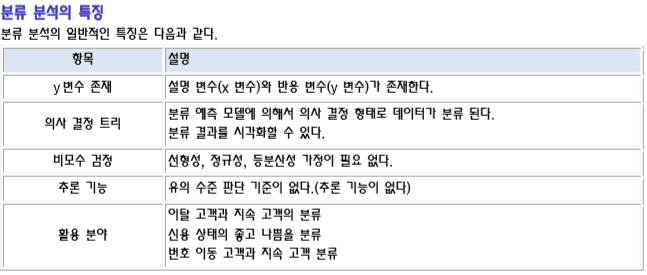<br><br>
> 고객 분류하기, 기업의 부도 예측, 주가 예측, 환율 예측, 경제 전망 등등<br><br>
> 기존 고객들의 여러 가지 정보를 이용하여 신용 상태를 파악한 다음, 새로운 고객에 대하여 향후 신용 상태 예측하기<br><br>
> 과거 환자들의 종양 검사를 토대로, 이를 통해서 새로운 환자에 대한 암을 진단하는데 이용하기 <br><br>
> 즉, 고객을 분류할 수 있는 변수들에 대한 규칙/특성들을 찾아내어, 미래 잠재 고객의 행동이나 반응을 예측하거나 유도하는데 활용된다. <br><br>
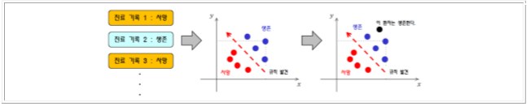<br><br>

## 의사 결정 트리
> 의사 결정 트리(Decision Tree)는 여러 가지 규칙을 순차적으로 적용시키면서 독립 변수 공간을 지속적으로 분할해 나가는  분류 모형이다. <br><br>
> 다음 그림은 온도에 가장 많은 영향을 미치는 요소들에 대한 의사 결정 트리이다 그림에서 보듯이 나무 구조 형태로 분류 결과를 도출해내는 방식이다. 분류시 독립(입력) 변수 중에서 가장 영향력이 있는 변수를 기준으로 이진 분류해 나가면서 크리스마스 트리처럼  나무(Tree) 구조 형태로 데이터를 분류해 나가는 방식이다.  <br><br>
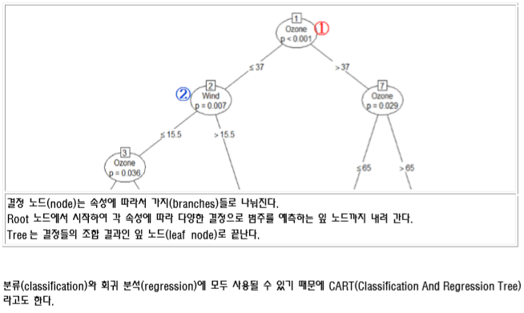<br>
<a href = "https://ko.wikipedia.org/wiki/결정_트리_학습법#%EC%A0%95%EB%B3%B4_%ED%9A%8D%EB%93%9D%EB%9F%89
"> 결정트리 참조 문서 링크 </a><br><br>
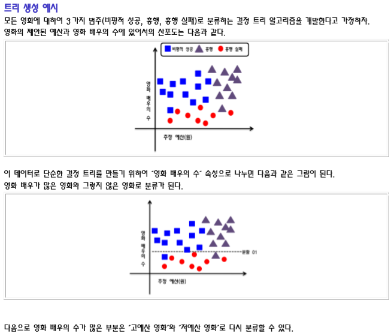<br><br>
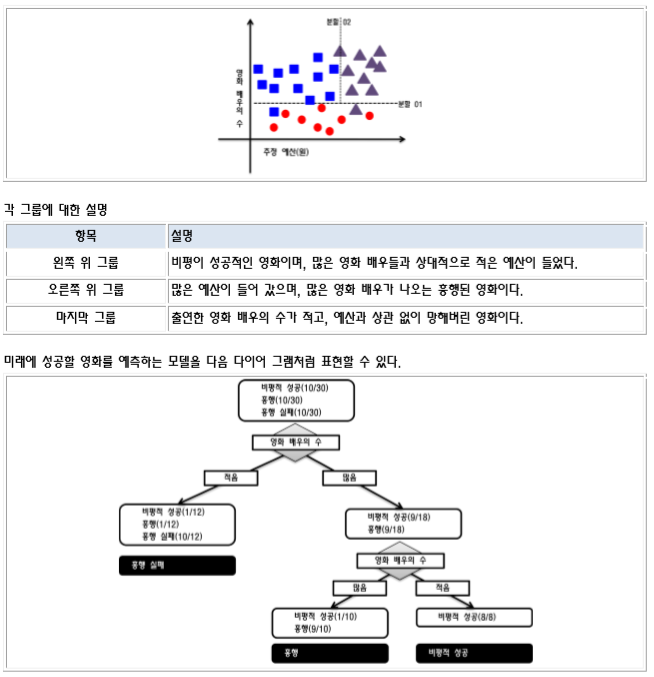<br><br>

## 결정 트리 관련 알고리즘 
> 결정 Tree 를 구성하는 알고리즘에는 주로 하향식 기법이 사용되며, 각 진행 단계에서는 주어진 데이터 집합을 가장 적합한 기준으로 분할하는 변수 값이 선택된다.  지니 불순도, 정보 획득량, 분산 감소 등이 있다

## 엔트로피(Entropy) 
> Entropy 는 열역학에서 말하는 의미와 비슷하게 정보의 무질서도 혹은 복잡도나 불확실성의 정도를 나타낸다. 주어진 데이터 집합에 서로 다른 종류(클래스)들이 많이 섞여 있으면 엔트로피가 높고, 같은 종류(클래스)들이 많이 있으면 엔트로피가 낮은데, 이것을 이용하여 범주 데이터가 얼마나 섞여 있는 지를 나타내는 지표가 된다. 엔트로피의 값은 최소 0 이고, 최대 값은 1 이다.<br><br>
> 바구니에 색상이 다른 두 종류의 공이 있다고 가정하자. 이 때 정보 엔트로피(정보의 기대 값)는 다음과 같이 구할 수 있다. 기대 값 = -∑p(xi)*log2p(xi)<br><br> 
>만약 바구니에 1 색상만 들어 있다면 log2(1) = 0 이므로 엔트로피는 0 이다. 즉, 데이터가 무질서하지 않고 균일하다는 의미이다.<br><br>
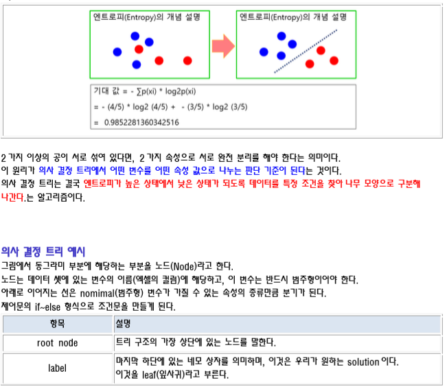<br><br>
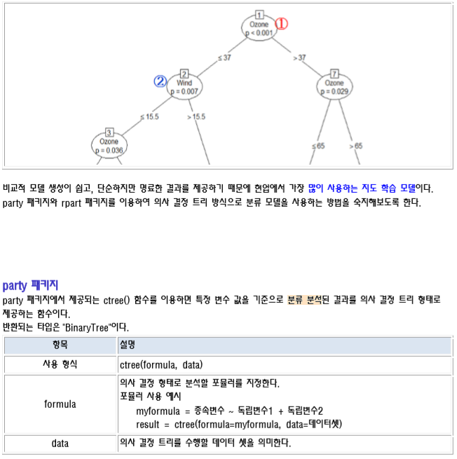<br><br>

## ctree() 함수 반환 결과 예시
```r
# ctree() 함수의 반환 결과는 BinaryTree 구조이다. 반환된 결과에 대한 세부 내용은 다음과 같다. 

#  Conditional inference tree with 5 terminal nodes # Response:  Temp  # Inputs:  Solar.R, Wind, Ozone  # Number of observations:  153 
# 1) Ozone <= 37; criterion = 1, statistic = 56.086 #        2) Wind <= 15.5; criterion = 0.993, statistic = 9.387 #              3) Ozone <= 19; criterion = 0.964, statistic = 6.299 #                     4)*  weights = 29  #              3) Ozone > 19 #                     5)*  weights = 69  #        2) Wind > 15.5 #               6)*  weights = 7  # 1) Ozone > 37 #         7) Ozone <= 65; criterion = 0.971, statistic = 6.691 #                8)*  weights = 22  #         7) Ozone > 65 #                9)*  weights = 26
```
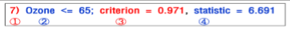<br><br>
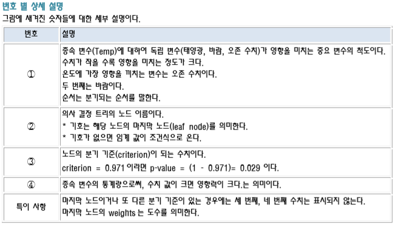<br><br>
## 분류 분석 결과 보기 
> ctree() 함수의 반환 결과에 대하여 plot() 함수를 사용하면 분류 분석 결과를 저장하고 있는 변수에 대하여 차트를  다음과 같이 그릴 수 있다.<br> 
> plot() 함수 사용시 간단히 보려면 type="simple" 옵션을 사용하면 된다.<br>
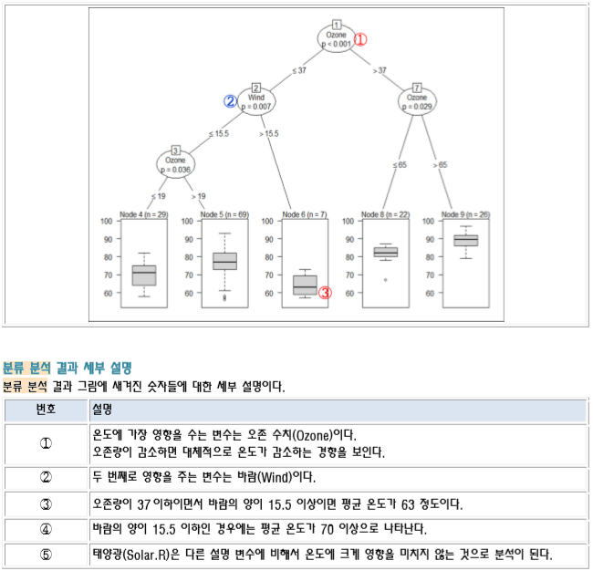<br>

## rpart 패키지  
> rpart 패키지에서 제공되는 rpart() 함수는 재귀 분할(recursive partitioning)이라는 의미를 갖는다.  기존 ctree() 함수에 비해서 2수준 요인으로 분산 분석을 실행한 결과를 트리 형태로 제공하여 모형을 단순화해준다. Gini Index가 작아지는 방향으로 움직이며, Gini Index를 가장 많이 감소 시키는 변수가 가장 큰 영향을 끼치는 변수가  된다.
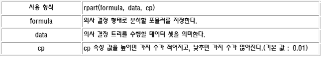<br>

## 사용 예시 소스코드
```r
library(rpart)
# setwd("D:\\Rwork\\bigdata\\S20191001")
data <- read.csv('custom_info.csv')
data

str(data)
colnames(data)

data$job <- as.factor(data$job)
unique(data$job)

data$marriage <- as.factor(data$marriage)
data$iscar <- as.factor(data$iscar)
data$coupon <- as.factor(data$coupon)
str(data)

mCoupon <- table(data$coupon)
mCoupon

no <- mCoupon[1]
yes <- mCoupon[2]

tot <- no + yes

# 엔트로피 계산
- (no / tot) * log2(no / tot) - (yes / tot) * log2(yes / tot)

getEntropy <- function(x) {
  facX <- factor(x)
  
  sumEntropy <- 0
  for(i in levels(facX)) {
    prob <- sum(x == i) / length(x)
    sumEntropy <- sumEntropy - prob * log2(prob)
  }
  return(sumEntropy)
}

couponEntropy <- getEntropy(data[, 'coupon'])
couponEntropy

chkList <- colnames(data)[1:5]
chkList

for(i in chkList) {
  mEntropy <- getEntropy(data[,i])
  cat(i, ' : ', mEntropy, '\n')
}

# tree 생성
## minsplit : 가지치기 개수
tree1 <- rpart(coupon ~ ., data = data, control = rpart.control(minsplit = 2))
plot(tree1, compress = T, uniform = T, margin = 0.1)
text(tree1, use.n = T, col = 'blue')
tree1
# node), split, n, loss, yval, (yprob)
# * denotes terminal node

mTable <- table(marriage = data$marriage, coupon = data$coupon)
chisq.test(mTable)
# p-value : 작을수록 잘 나누어진 것.

# 지니 계수 구하기
getGini <- function(x) {
  facX <- factor(x)
  
  sumGini <- 0
  for(i in levels(facX)) {
    prob <- sum(x == i) / length(x)
    sumGini <- sumGini + prob ** 2
  }
  return(1 - sumGini)
}

couponGini <- getGini(data[, 'coupon'])
couponGini

for(i in chkList) {
  mGini <- getGini(data[,i])
  cat(i, ' : ', mGini, '\n')
}

# iris
head(iris)
unique(iris$Species)

# Species를 결정 짓는 컬럼에 대하여 의사결정 트리로 풀어 보세요.
# 훈련:검정 = 7:3으로 분류하기
set.seed(1234)
idx <- sample(1:nrow(iris), 0.7*nrow(iris))
idx

tr <- iris[idx, ]
test <- iris[-idx, ]
colnames(iris)

fo <- Species ~ Sepal.Length + Sepal.Width + Petal.Length + Petal.Width
model <- rpart(formula = fo, data = iris, control = rpart.control(minsplit = 2))
plot(model, compress = T, uniform = T, margin = 0.1)
text(model, use.n = T, col = 'blue')
model
# 분류 모델 생성
# 예측하기 : 다항 분류는 softmax 함수
# 다항수중 하나의 변수만 대빵 크게 만드는 것.
dim(test)
prop.predction <- predict(model, test)

predction <- ifelse(prop.predction[, 1]>=0.5, "setosa", ifelse(prop.predction[, 2]>=0.5, "versicolor", "virginica"))
head(predction)

mytable <- table(predction, test$Species)
mytable

bunja <- mytable[1, 1] + mytable[2, 2] + mytable[3, 3]
bunmo <- sum(mytable)

accuracy <- bunja/bunmo
round(100*accuracy, 3)
```