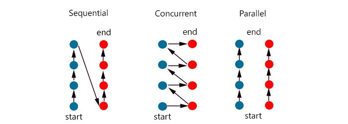

## Concurrency(동시성) vs Parallelism(병렬성)

|                   동시성                   |                    병렬성                   |
|:------------------------------------------:|:-------------------------------------------:|
|      동시에 실행되는 것 같이 보이는 것     |  실제로 동시에 여러기지 작업이 처리되는 것  |
| 싱글 콩에서 멀티쓰레드 를 동작 시키는 방식 | 멀티 코어에서 멀티 쓰레드를 동작시키는 방식 |
|            한번에 많은 것을 처리           |            한번에 많은 일을 처리            |
|                논리적인 개념               |                물리적인 개념                |



> 출처 :  http://www.dietergalea.com/parallelism-concurrency/
<br>

## 동시처리 큐와 스택

> import java.util.Map; <br>
> import java.util.Queue; <br>
> import java.util.concurrent.ConcurrentHashMap; <br>
> import java.util.concurrent.ConcurrentLinkedQueue; <br>

```java
public static void main(String[] args) {
	// 동시 처리용 Map
	Map<Integer, String> map = new ConcurrentHashMap<Integer, String>();
	map.put(1, "신");
	
	// 동시 처리용 Queue
	Queue<Message> msgQuene = new ConcurrentLinkedQueue<Message>();
	msgQuene.add(new Message("SMS", "신"));
}
```

<br>

## Stream을 이용한 병렬처리 List

```java
//Stream은 java8부터 추가된 컬렉션 요소를 하나씩 참조해서 람다식으로 처리할 수 있도록 해준다.
import java.util.Arrays;
import java.util.List;
import java.util.stream.Stream;

public class ParallelExam {

	public static void main(String[] args) {
		// TODO Auto-generated method stub
		List<Student> list = Arrays.asList(
				new Student("김", 30),
				new Student("신", 27),
				new Student("김", 30),
				new Student("신", 27),
				new Student("김", 30),
				new Student("신", 27),
				new Student("김", 30),
				new Student("신", 27)
		);
		
		// 처리
		Stream<Student> stream = list.stream();	
		stream.forEach(ParallelExam::print);
		
		System.out.println();
		
		// 병렬처리
		Stream<Student> parellelStream = list.parallelStream();
		parellelStream.forEach(ParallelExam::print); // 람다식
	}
	
	public static void print(Student temp) {
		String name = temp.getName();
		int code = temp.getCode();
		
		System.out.println(name + " " + Thread.currentThread().getName());
	}
}
```

## Student 구현 부분

```java
public class Student {
	private String name;
	private int code;
	
	public Student() {
		// TODO Auto-generated constructor stub
	}
	
	public Student(String name, int code) {
		super();
		this.name = name;
		this.code = code;
	}
	
	public int getCode() {
		return code;
	}
	
	public String getName() {
		return name;
	}
}
```