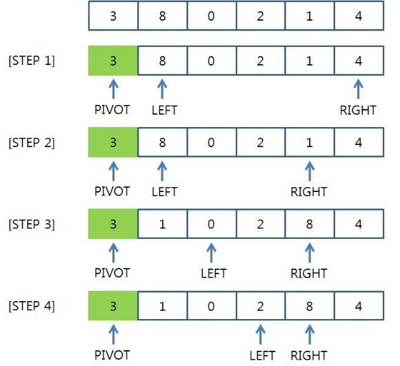

# 퀵 정렬
- 대표적인 **분할 정복** 알고리즘 이다. 평균 속도가 O(N*logN) 이다.

## 퀵 정렬(Quick sort) 알고리즘의 구체적인 개념
- 퀵 정렬은 하나의 큰 문제를 두 개의 작은 문제로 분할하는 식으로 빠르게 정렬 합니다.
- 특정한 값을 기준으로 큰 숫자와 작은 숫자를 서로 교환한 뒤에 배열을 반으로 나눕니다.
- 이론 출처 : https://blog.naver.com/ndb796/221226813382, https://yujuwon.tistory.com/entry/%ED%80%B5-%EC%A0%95%EB%A0%AC
- 그림 출처 : https://yujuwon.tistory.com/entry/%ED%80%B5-%EC%A0%95%EB%A0%AC



1. 먼저 PIVOT 계수를 정한다. PIVOT 계수는 임의로 선정할 수 있으나, 중간 크기의 숫자를 PIVOT 계수로 선정하는 것이 가장 효율적이기 때문에 대부분 3개의 임의의 숫자를 랜덤으로 선택한 후 3개 중 가운데 값을 PIVOT 계수로 정한다.

2. PIVOT 값과 LEFT 값을 비교한다. 만약 LEFT 값이 PIVOT 값보다 크다면 PIVOT 값과 RIGHT 값을 비교한다.

RIGHT 값이 PIVOT 값보다 크다면, RIGHT 인덱스를 왼쪽으로 위치시킨 후 다시 PIVOT 값과 비교한다.

3. RIGHT 값이 PIVOT 값보다 작다면, LEFT 값과 RIGHT 값을 바꾼 후, LEFT 값을 오른쪽으로 한칸 전진시킨다.

4. LEFT 값과 RIGHT 값이 만날 때까지 2~3번 과정을 반복한다.


5. LEFT와 RIGHT가 만나면 해당 값과 PIVOT 값을 비교한다. PIVOT 값이 크면 오른 쪽 작으면 왼쪽에 위치 시킨다.

6. 3을 기준으로 블록을 크게 3보다 큰 값, 3보다 작은 값으로 나뉘게 된다. 3보다 작은 블록에 대해 다시 PIVOT 계수를 설정한다.

7. 기존에 한 방식대로 다시 LEFT와 RIGHT 값을 PIVOT과 비교한 후, 값을 교환한다.

8. 3보다 큰 블록에 대해서도 위와 같이 비교한다.

9. 최종 sorting이 완료된다.

```python
def quickSort(list, start, end):
    ## 원소가 하나 일때.
    if(start >= end):
        return

    pivot = start ## 기준 값은 보통 start 값으로 지정
    i = start+1 ## 기준 값 다음부터 비교를 위해 start위치에 +1 해준다.
    j = end ## 끝 값
    temp = 0 ## 값을 서로 교환해 줄때 필요한 임시 저장소

    while i <= j: ## 서로 엇갈릴때 까지
        ## 기준 값 보다 큰 것을 오른쪽 에서 찾는다.
        while (list[i] <= list[pivot]) and (i < end):
            i += 1

        ## 기준 값 보다 작은 것을 오른쪽 에서 찾는다.
        while (list[j] >= list[pivot]) and (j > start):
            j -= 1

        if i > j: ## 엇갈린 상태
            temp = list[j]
            list[j] = list[pivot]
            list[pivot] = temp
        else: ## 엇갈리지 않고 왼쪽 오른쪽 에서 조건에 맞는 값을 찾았을때.
            temp = list[j] ## 각 조건에 맞는 값을 서로 교환
            list[j] = list[i]
            list[i] = temp

    ## 재귀적 함수를 이용해 구현 한다.
    ## 각각 왼쪽 오른쪽에 정렬을 끝마친 부분은 제외하고 정렬을 위해 인덱스를 정해 준다.
    quickSort(list, start, j-1)
    quickSort(list, j+1, end)

arrayList = [1, 9, 7, 8, 6, 5, 2, 4, 3, 0]
## 퀵정렬 실행
quickSort(arrayList, 0, len(arrayList)-1)
## 출력
print(arrayList)
```