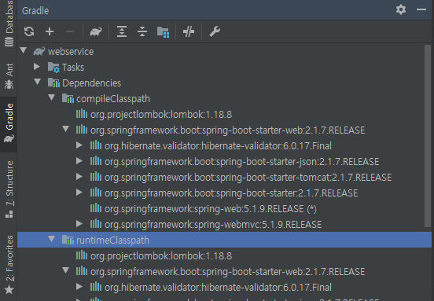
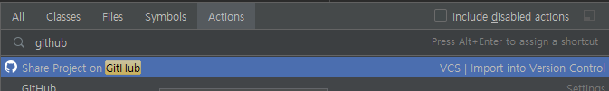
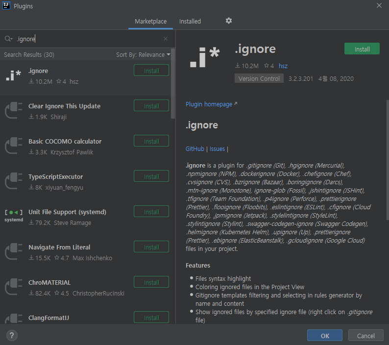

# SpringBoot 

요즘 STS + Maven 조합으로 개발을 진행 하면서 다른 블로그나 여러 IT 동향들을 살펴 보면<br>
IntelliJ + Gradle 조합으로 개발을 진행하면 매우 편하다 라는 의견이 많아 한번 진행 해보려고 한다<br>
아래는 IntelliJ로 Gradle Project를 생성후 이를 SpringBoot Project로 바꾸는 기본적인 소스 이다.<br>

참고 서적 : <a href="https://search.naver.com/search.naver?sm=top_sug.pre&fbm=0&acr=1&acq=%EC%8A%A4%ED%94%84%EB%A7%81+%EB%B6%80%ED%8A%B8%EC%99%80+&qdt=0&ie=utf8&query=%EC%8A%A4%ED%94%84%EB%A7%81+%EB%B6%80%ED%8A%B8%EC%99%80+aws%EB%A1%9C+%ED%98%BC%EC%9E%90+%EA%B5%AC%ED%98%84%ED%95%98%EB%8A%94+%EC%9B%B9+%EC%84%9C%EB%B9%84%EC%8A%A4">스프링 부트와 AWS로 혼자 구현하는 웹 서비스 : 이동욱 지음</a>

---

## build.gradle

```gradle
buildscript {
    ext { // 그래이들 내 에서 전역 변수 사용을 위한 ext 예약어
        // Boot 버전
        springBootVersion = '2.1.7.RELEASE'
    }
    repositories {
        mavenCentral()
        jcenter()
    }
    dependencies { // 위 ext 문장 안의 springBoot 변수를 대입 시켜 그레이들 플러그인에서 의존성 을 받겠따는 의미
        classpath("org.springframework.boot:spring-boot-gradle-plugin:${springBootVersion}")
    }
}

// Spring 개발을 위해 그레이들 에서 필수적으로 기재 하여아할 플러그인 4가지 이다.
apply plugin: 'java'
apply plugin: 'eclipse'
apply plugin: 'org.springframework.boot'
apply plugin: 'io.spring.dependency-management'

// 각종 의존성 라이브러리 들을 어떤 원격 저장소에서 받을지를 정한다.
repositories {
    // User 라이브러리 등록이 mavenCentral보다는 jcenter가 좀더 간결 하고 쉽다.
    // jcenter에 등록된 라이브러리는 mavenCentral에도 업로드 자동화 설정이 가능하다.
    mavenCentral()
    jcenter()
}

dependencies {
    // 의존성에 버전명을 입력 하지 않으면 버전 충돌 걱정 없이 개발이 가능하다.
    compile('org.springframework.boot:spring-boot-starter-web')
    compile('org.projectlombok:lombok')
    testCompile('org.springframework.boot:spring-boot-starter-test')
}
```

<span style="color:skyBlue">**잠깐!**

설치 후 바로 개발에 착수 해도 되겠지만, 인텔리제이 의 UI중<br> Gradle 탭을 클릭하여 의존성 주입이 제대로 반영이 되어 있는지 확인 해야 한다.



그리고... 이왕 하는김에 Git도 연동 해보자!<br>
Ctrl + Shift + A 단축키를 이용해 "Github" 를 검색 해보자!

그리고 아래 그림에서 처럼 Share project on github를 누르고 깃에 로그인 한다.



그리고 순서대로 나오는 설정을 해준다.<br>
Repository Name에 등록한 이름으로 깃허브에 저장소가 생성 된다.<br>
<br>
다만 커밋 할 때 인텔리제이 환경 파일인 .idea 관련한 디렉토리 및 파일들은 커밋 하지 않기 때문에 이를 .gitignore 에서 제외 시켜 보도록 하자.<br>
<br>
다만, 인텔리제이 에서는 이를 지원하지 않고 플러그인 으로 이를 설정 할 수 있다.<br>
<br>

플러그인 에서는...
- 파일 위치 자동완성
- 이그노어 처리 여부 확인
- 다양한 이그노어 파일 지원

아래는 .ignore 플러그인 설치 방법이다.<br>
Ctrl + Shift + A 를 이용핸 Plugins 를 검색해 Action을 선택 설치 팝업창을 띄운다.<br>
.ignore를 검색 해본다.<br>



설치 해준다!<br>

프로젝트 네비게이터 에서 프로젝트 선택후 ALT+INSERT 키를 통해 ignore를 생성해 준다.<br> 여러 템플릿을 선택 할 수 있지만 그냥 생성을 눌러 빈 파일을 생성해 준다.<br>
그리고 아래 두줄을 추가해 준다.

```gitignore
.gradle
.idea
```

그럼 이제 .gitignore 파일을 깃 에다가도 등록 해야 한다.<br>
[Ctrl+K] 를 눌러 커밋 창을 열어 커밋 후 [Ctrl+Shift+K] 를 눌러 푸시 한다.<br>

git에 들어가 commit 내용 을 확인해 정상적으로 등록이 되었는지 확인해 본다!<br>

이로써 기본적인 개발환경 셋팅은 끝났다... 항상 느끼는 거지만 프로젝트 시작 할때마다 개발환경 셋팅에 시간이 참 많이간다...<br>
<br>
<br>

---

PS : gitignore 를 설정 했음에도 불구하고 정상적으로 제외가 되지 않을 경우 아래 명령어 실행(프로젝트 디렉토리에서)<br>

> git rm -r --cached . <br>
> git add .