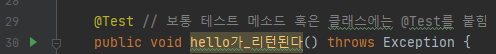
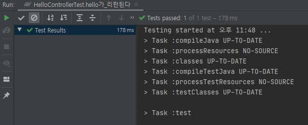

# 단위 테스트(Unit Test)

- TDD와 Unit Test는 다른 이야기 이다.
- TDD는 테스트가 주도하는 개발 이다. TEST CODE를 먼저 장성하는 것부터 시작 한다.
    - Red : 항상 실패하는 테스트를 먼저 작성한다.
    - Green : 테스트가 통과하는 프로덕션 코드를 작성한다.
    - Refactor : 테스트가 통과하면 코드를 리펙토링 한다.
- 반면 단위 테스트는 TDD의 첫번째 단계인 기능 단위의 테스트 코드를 작성 하는 것이다.

여기서는 TDD와 달리 테스트 코드를 꼭 먼저 작성해야 하는 것도 아니고, 리팩토링도 포함되지 않는다. 순수하게 테스트 코드만 작성한다.<br>
테스트 코드를 먼저 배우고 TDD를 학습 하는게 좋다.<br>

# 테스트 코드의 필요성

- 빠른피드백 이 존재한다.
- 테스트코드가 존재 하므로 톰켓 을 리부팅 할 필요가 없어진다.
- 자동 검증으로 인해 SysOut 을 통한 수동검을을 할 필요가 없다.
- 개발자의 단위 기능을 안전하게 지켜준다.

참고 서적 : <a href="https://search.naver.com/search.naver?sm=top_sug.pre&fbm=0&acr=1&acq=%EC%8A%A4%ED%94%84%EB%A7%81+%EB%B6%80%ED%8A%B8%EC%99%80+&qdt=0&ie=utf8&query=%EC%8A%A4%ED%94%84%EB%A7%81+%EB%B6%80%ED%8A%B8%EC%99%80+aws%EB%A1%9C+%ED%98%BC%EC%9E%90+%EA%B5%AC%ED%98%84%ED%95%98%EB%8A%94+%EC%9B%B9+%EC%84%9C%EB%B9%84%EC%8A%A4">스프링 부트와 AWS로 혼자 구현하는 웹 서비스 : 이동욱 지음</a>

---

## Source

```java
// 간단하게 src/main/java 디렉토리에 나만의 패키지를 만듭니다.
// 먼저 메인 클래스를 작성 합니다.

package com.moreget.book.springboot;

import org.springframework.boot.SpringApplication;
import org.springframework.boot.autoconfigure.SpringBootApplication;

@SpringBootApplication // SpringBoot의 최상위 어노테이션
public class Application {
    public static void main(String[] args) {
        // 내장 WAS 실행 가능하게 해줌
        // 왜? 언제 어디서나 동일한 환경에서 배포 가능하게 함
        SpringApplication.run(Application.class, args);
    }
}
```

---

```java
// 나만의 패키지 하위에 web 패키지도 하나더 추가 시킵니다.
// 아래 컨트롤러 Class를 작성 합니다.

package com.moreget.book.springboot.web;

import org.springframework.web.bind.annotation.GetMapping;
import org.springframework.web.bind.annotation.RestController;

// JSON으로 응답 하게끔 해주는 Controller 설정
// ResponseBody를 메소드 마다 안붙혀도 됨.
@RestController
public class HelloController {

    // REST중 GET통신을 위한 어노테이션
    // 예전엔 RequestMapping(method="RequestMethod.GET")
    @GetMapping(path = "/hello")
    public String hello() {
        return "hello";
    }
}
```

---

```java
// 그리고 test/java 디렉토리 에다가도 위와 동일한 패키지만 만들어 주고
// web 패키지 안에다가 아래 처럼 test 코드를 작성 합니다.

package com.moreget.book.springboot.web;

import org.junit.Test;
import org.junit.runner.RunWith;
import org.springframework.beans.factory.annotation.Autowired;
import org.springframework.boot.test.autoconfigure.web.servlet.WebMvcTest;
import org.springframework.test.context.junit4.SpringRunner;
import org.springframework.test.web.servlet.MockMvc;

import static org.springframework.test.web.servlet.request.MockMvcRequestBuilders.get;
import static org.springframework.test.web.servlet.result.MockMvcResultMatchers.content;
import static org.springframework.test.web.servlet.result.MockMvcResultMatchers.status;

// 테스트를 진행할 때 Junit에 내장된 실행자 외에 다른 실행자를 실행 시킵니다.
// 여기서는 SpringRunner라는 스프링 실행자를 사용.
// 즉, 스프링 부트 테스트와 Junit 사이에 연결자 역할을 합니다.
@RunWith(SpringRunner.class)

// 여러 어노테이션 중 Web(Spring MVC)에 집중 할 수 있는 어노테이션
// 선언할 경우 @Controller, @ControllerAdvice등... 사용 가능
// 단, @Service, @Component, @Repository등은 사용 불가
// 여기서는 컨트롤러만 사용하기 때문에 사용
@WebMvcTest(controllers = HelloController.class)
public class HelloControllerTest {

    @Autowired // 스프링이 관리하는 Bean을 주입 받음
    private MockMvc mvc;

    @Test // 보통 테스트 메소드 혹은 클래스에는 @Test를 붙힘
    public void hello가_리턴된다() throws Exception {
        String hello = "hello";

        // 메소드 체이닝
        mvc.perform(get("/hello")) // MockMvc를 통해 /hello 주소로 HTTP GET을 요청
                // mvc.perform을 검증, HTTP Header의 Status검증(여기서는 200 OK)
                .andExpect(status().isOk())
                // mvc.perform을 검증, 응답 본문의 내용을 검증
                // Controller에서 hello를 리턴하기 때문에 이값이 맞는지 검증
                .andExpect(content().string(hello));
    }
}
```

## 인텔리제이 에서의 테스트 코드 실행 방법

아래 처럼 녹색 화살표 를 클릭한 후 첫번째 Run 명령을 수행 합니다.

<br><br>

그리고 아래 처럼 Test Result가 Passed 라면 성공 입니다.

