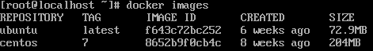
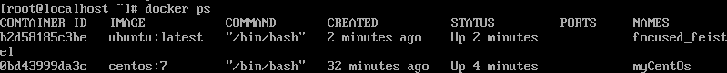

## Centos7 에서 Docker Engin 설치

> \# yum install -y yum-utils 
> \# yum-config-manager --add-repo https://download.docker.com/linux/centos/docker-ce.repo 
> \# yum install -y docker-ce 
> \# systemctl start docker 
> \# wget -q0- get.docker.com | sh 

 

> 혹시 wget가 존재하지 않는다면 `\# yum install wget`를 수행해야 한다.

 

도커 엔진 설치를 완료 하였다면 아래 명령어를 수행하여 확인을 한다.

> \# docker info 엔진 정보 
> \# docker -v 도커 버전 

 

도커 엔진을 확인 하였다면 컨테이너를 생성 해야한다. 아래는 centos7 버전으로 Docker 컨테이너를 생성 하는 방법중 하나이다. 

> \# docker run -i -t --name myCentOs centos:7

- docker run 명령어는 컨테이너 생성및 실행과 동시에 컨테이너 내부로 들어간다.
- -i -t 는 컨테이너와 상호 I/O를 가능케 한다.
- run은 docker pull( 이미지가 없을 때 ) -> create -> start -> attach( -i -t 옵션 사용시 ) 명령을 모두 수행한다.

 

컨테이너 내부 로 접속 되었을때 `{호스트}@{Hex해시값}:/#` 으로 이루어진 셸을 볼 수가 있는데 16진수 해시값은 컨테이너의 고유한 ID의 앞 일부분 이다.

- exit를 입력 하면 docker 컨테이너가 정지 되면서 빠져나온다.
- Ctrl + P,Q를 입력하면 도커 컨테이너는 정지되지 않는다.

내가 지금까지 다운로드한 Docker 이미지를 확인 해보자.

> \# docker images 

 

아래는 run 명령어 대신 직접 create -> start -> attach 를 수행해보자.

> \# docker create -i -t --name `mycentos` centos:7 
> \# docker start `mycentos` 
> \# docker attach `mycentos` 

 

위 처럼 run명령어 대신 pull받은 이미지를 기반으로 직접 `create, start, attach`를 수행 하여 docker 컨테이너 생성 및 내부 진입이 가능하다. 

 
컨테이너를 생성 하였으면, 컨테이너 목록 확인도 해보자

> docker ps -a

 

- docker ps는 현재 up되어있는 컨테이너만, -a는 종료된 컨테이너 까지 조회한다.
- docker inspect `{docker name}` | grep Id 로 컨테이너 ID를 전부 확인 가능하다.
- IMAGE는 컨테이너의 현재 이미지 종류이다.
- COMMAND는 컨테이너가 시작될 떄 실행될 명령어 이다.
- CREATED는 컨테이너가 생성되고 난 뒤 흐른 시간이다.
- STATUS는 컨테이너의 상태를 나타낸다. UP, Exited, Pause등이 있다.
- PORTS는 컨테이너가 개발한 포트와 호스트에 연결된 포트를 나열한다.
- NAMES는 컨테이너의 고유한 이름이다 --name 옵션으로 설정한 값이 설정된다. 그외엔 도커엔진에서 임의로 설정한다.

 

혹시 컨테이너의 이름이 마음에 안들경우엔 아래 처럼 변경한다.

> \# docker rename `{원래이름} {변경할이름}` 

 

아래는 컨테이너를 삭제 하는 방법이다. 우선 실행중인 컨테이너를 멈춘후 삭제한다.

> \# docker stop `{컨테이너 이름}` 
> \# docker rm `{컨테이너 이름}` 

- stop하지 않고 바로 삭제하는 명령어는 \# docker rm -f `{컨테이너 이름}` 이다.

 

아래는 현재 stop된 모든 컨테이너를 삭제하는 명령어 이다.

> \# docker container prune

- 아래 명령어 셋을 사용하면 좀더 편하게 모든 컨테이너를 정지, 삭제 할 수 있다.
- docker stop $(docker ps -a -q)
- docker rm $(docker ps -a -q)